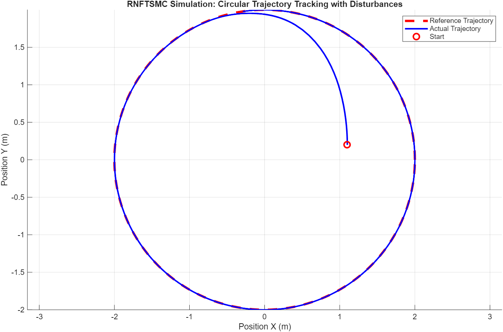
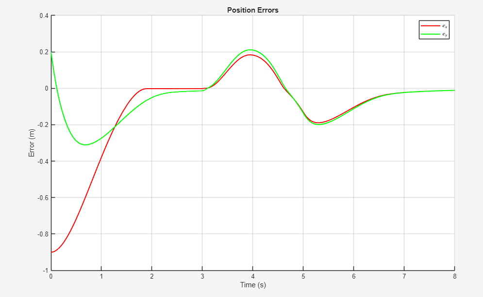

# Projet-sensor-based-controll
# Robust Nonlinear Controller for a Two-Wheeled Mobile Robot

## Project Overview

This project focuses on the design and implementation of a **robust nonlinear controller** for a two-wheeled mobile robot. The main goal is to make the robot follow a **circular trajectory** while handling external disturbances, ensuring stable and accurate motion.

The project is divided into two main parts:  
1. **Software:** Simulations and algorithm development performed on a computer, including Matlab simulations and ROS 2 virtual testing.  
2. **Hardware:** Implementation on a physical robot (TurtleBot3), including real-time ROS 2 execution, robot control, and demonstration videos.

This structure allows for a smooth transition from simulation to real-world experimentation, ensuring that the controller is robust and reliable before deployment on the actual robot.

## Software: Matlab Simulation

### Overview
The Matlab code implements a **Robust Nonlinear Fast Terminal Sliding Mode Controller (RNFTSMC)** for a two-wheeled mobile robot.  
The main goal is to make the robot follow a **circular trajectory** while handling external disturbances.

All Matlab scripts are located in the folder: `matlab_simu_code/`

### How to Run
1. Download all files from the repository and place them in the same folder on your computer.  
   - Make sure `main.m`, `trajectory_reference.m`, `error_dynamics_RNFTSMC.m`, and any other required scripts are **in the same directory**.
2. Open Matlab and navigate to that folder:
   ```matlab
   cd 'path_to/matlab_simu_code'
3. Run the main simulation script:
   ```matlab
   main.m
4. The simulation will:
   - Compute the reference trajectory
   - Apply the RNFTSMC controller
   - Plot the robot’s actual trajectory versus the reference
   - Display the position errors over time
  
### Simulation Results

The simulation shows the robot following a **circular trajectory** while compensating for disturbances.  
The RNFTSMC controller ensures that the robot stays close to the reference path despite external perturbations.



> In the figure above, the **red dashed line** represents the reference circular trajectory,  
> while the **blue line** shows the actual trajectory of the robot.  
> The starting position is marked with a red circle.  
> The results demonstrate the effectiveness of the robust nonlinear controller in maintaining accurate tracking.



> The figure above shows the **position errors** over time for X and Y coordinates.  
> It highlights how the controller reduces the deviation from the reference trajectory and maintains stable tracking despite disturbances.

# ROS 2 / WSL Simulation Tutorial

The ROS 2 simulation provides a realistic environment to test the controller before deploying it on physical hardware (TurtleBot3). We use the RNFTSMC Controller package developed in Python (`simu_rnftsmc`).

## 1. Prerequisites and Environment Setup

This tutorial assumes you are working either within **WSL 2** or a **native Linux installation** (Ubuntu), and that you have a functional **ROS 2 Humble** (or later) setup.

### Dependencies
Ensure you have the necessary ROS 2 packages and Python dependencies installed.

```bash
# Update ROS 2 dependencies
sudo apt update
rosdep install --from-paths src --ignore-src -r -y
```

### Navigate to the Workspace Root
The ROS 2 workspace root is where the `src` folder is located (inside `Ros_code`).

```bash
cd ~/Projet-sensor-based-controll/Ros_code
```

## 2. Building the ROS 2 Controller Package

You need to build the Python package (`simu_rnftsmc`) so that the executable node is created and recognized by ROS 2.

### Build the package
```bash
colcon build --packages-select simu_rnftsmc
```

### Source the environment
This step is crucial and must be done in every new terminal you open before running ROS 2 commands.

```bash
source install/setup.bash
```

> **Note:** If you are using a base ROS 2 setup, you might also need to source your main ROS installation:
> ```bash
> source /opt/ros/humble/setup.bash
> ```

## 3. Running the Simulation Node

The simulation is a simple self-contained environment where the controller node calculates the dynamics, updates the robot's pose, and publishes the results.

### Execute the RNFTSMC Controller Node
```bash
ros2 run simu_rnftsmc rnftsmc_controller
```

The node will start running at the defined control rate (50 Hz by default). You should see the initial log message:
```
RNFTSMC controller started at 50.0 Hz.
```

## 4. Visualization with RViz2

To visualize the trajectory, robot pose, and the path, you need to launch RViz2 in a separate terminal.

### Open a New Terminal (WSL)
Source the environment (mandatory):

```bash
cd ~/Projet-sensor-based-controll/Ros_code
source install/setup.bash
```

### Launch RViz2
```bash
rviz2
```

### Configure RViz2
Once the RViz window opens:
1. In the **Display** panel, set the **Fixed Frame** to `map`.
2. Click **Add** (bottom left) and add the following displays:
   - **Marker** (Topic: `/reference_trajectory`) → Shows the red circular path.
   - **Path** (Topic: `/robot_path`) → Shows the blue line traced by the robot.
   - **PoseStamped** (Topic: `/pose`) → Shows the current estimated pose/position.
   - **TF** → Shows the transformation tree (`map` → `base_link`, etc.)

You will see the robot's pose (`base_link`) closely follow the red reference circle, demonstrating the controller's effectiveness in tracking and disturbance rejection, mirroring the results seen in the Matlab simulation.

